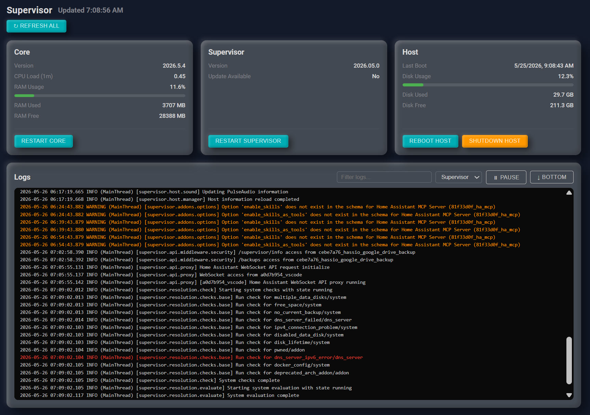

# Supervisor Panel

A replacement for the Home Assistant Supervisor Panel that was deprecated in HA 2026.5.



## About

HA 2026.5 removed the `hassio-main` panel registration. The Supervisor Panel sidebar entry stopped working and the restart buttons (Restart Core, Restart Supervisor, Reboot Host, Shutdown Host) were removed from the UI. This custom panel brings that functionality back using the HA WebSocket API and native System Monitor entities.

## Features

- Core and Supervisor version with update badge when available
- CPU load and RAM usage with color-coded progress bars
- Host last boot, disk usage and free space
- Live logs (Supervisor / Core / Host) with filter, pause/resume, and auto-scroll
- Restart Core, Restart Supervisor, Reboot Host, Shutdown Host buttons

## Requirements

- Home Assistant with Supervisor (HAOS or supervised install only)
- [System Monitor Integration](https://www.home-assistant.io/integrations/systemmonitor/) must be installed and enabled

> **Note:** The System Monitor integration provides the CPU, RAM, and disk statistics. Without it the stats will show dashes but the panel will still function.

## Installation

### HACS (Custom Repository)

1. In HACS go to **Frontend** → **Custom Repositories**
2. Add `https://github.com/Pjarbit/supervisor-panel` as category **Frontend**
3. Install **Supervisor Panel**
4. Add the following to your `configuration.yaml`:

```yaml
panel_custom:
  - name: supervisor-panel
    sidebar_title: Supervisor Panel
    sidebar_icon: mdi:home-assistant
    url_path: super-panel
    module_url: /local/supervisor-panel.js
    require_admin: true
```

5. Full HA restart required

### Manual Install

1. Download `supervisor-panel.js` from this repo
2. Place it in your `/config/www/` folder
3. Add the following to your `configuration.yaml`:

```yaml
panel_custom:
  - name: supervisor-panel
    sidebar_title: Supervisor Panel
    sidebar_icon: mdi:home-assistant
    url_path: supervisor-panel
    module_url: /local/supervisor-panel.js
    require_admin: true
```

4. Full HA restart required

## Removal

1. Delete `supervisor-panel.js` from `/config/www/`
2. Remove the `panel_custom` entry from `configuration.yaml`
3. Full HA restart required

## Support

If the stats cards show dashes, make sure the System Monitor integration is installed:  
**Settings → Devices & Services → Add Integration → System Monitor**

## A Note from the Developer

This integration is free and will always be free. If you find it useful, skip the coffee and give $5 to someone who needs it.

## License

MIT
